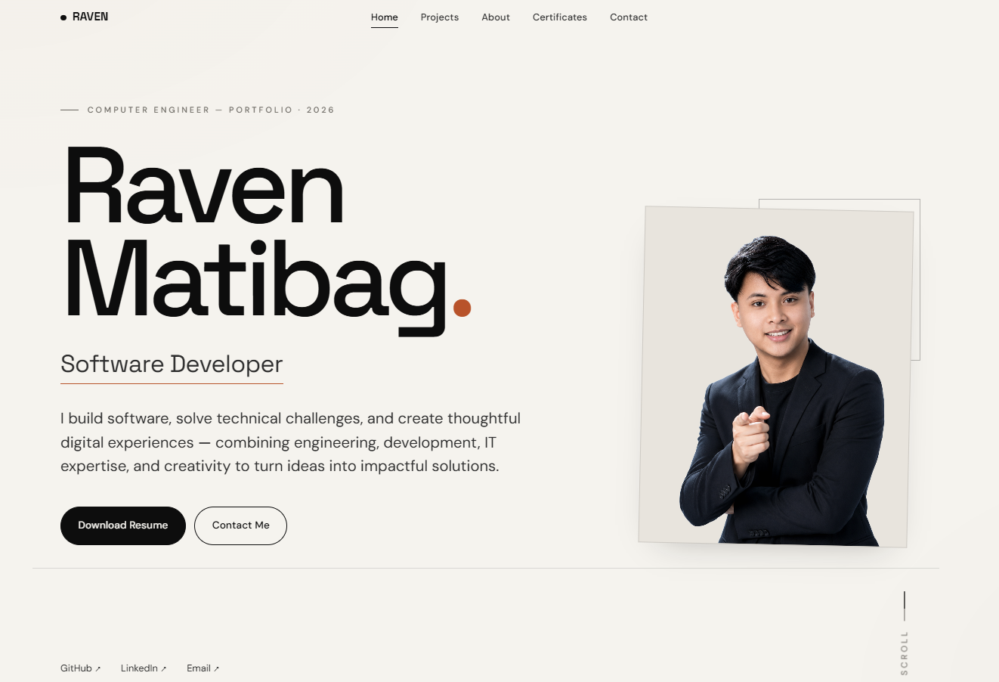

# Raven Matibag — Portfolio

An editorial-style personal portfolio site for Raven Matibag — a Computer Engineering graduate and Software Engineer — built with vanilla HTML, CSS, and JavaScript.



## Live Demo

> **[ravenmatibag.github.io/portfolio](https://ravenmatibag.github.io/portfolio/)**

## Features

- Editorial, single-page layout with smooth-scrolling section navigation
- Animated typing effect in the hero section
- Scroll-triggered reveal animations
- Auto-scrolling technology marquee
- Cursor-following live preview on the project list (desktop/pointer devices)
- Dedicated **Projects** and **Certifications** index pages
- Contact form with client-side validation, submitting via Formspree
- Fully responsive, mobile-friendly navigation
- Accessible markup: semantic sections, ARIA labels, `aria-live` regions, `prefers`-aware interactions

## Tech Stack

- **HTML5** — semantic markup across three pages
- **CSS3** — custom properties (design tokens), Grid/Flexbox layout, no framework or preprocessor
- **JavaScript (vanilla, ES6+)** — no external JS dependencies or build step
- **Google Fonts** — Space Grotesk, DM Sans, JetBrains Mono

No build tools, package manager, or framework are required — this is a static site that runs directly in the browser.

## Folder Structure

```
portfolio/
├── assets/
│   ├── images/          # Profile & about-page portraits
│   ├── screenshots/      # Project preview screenshots
│   ├── certificates/     # Certification images
│   ├── icons/            # Favicon
│   └── documents/        # Resume (PDF)
├── css/
│   └── style.css
├── js/
│   └── script.js
├── index.html             # Home (hero, projects, about, certificates, contact)
├── projects.html          # Full projects index
├── certifications.html    # Full certifications index
├── manifest.json          # Web app manifest
├── robots.txt
├── sitemap.xml
├── README.md
├── LICENSE
├── CONTRIBUTING.md
├── SECURITY.md
├── CHANGELOG.md
└── .gitignore
```

## Installation

Clone the repository:

```bash
git clone https://github.com/ravenmatibag/portfolio.git
cd portfolio
```

No dependencies to install — the site is plain HTML/CSS/JS.

## Usage

Open `index.html` directly in a browser, or serve it locally so relative paths and fonts behave exactly as they would in production:

```bash
# Using Python
python3 -m http.server 8000

# Or using Node's http-server (npx, no install needed)
npx http-server .
```

Then visit `http://localhost:8000`.

## Customization

- **Colors, spacing, and typography** — defined as CSS custom properties at the top of `css/style.css` under `:root`.
- **Content** — hero copy, about text, timeline, and contact details live directly in `index.html`.
- **Projects** — add or edit entries in the `#projectList` section of `index.html` and the matching cards in `projects.html`.
- **Certifications** — add or edit entries in the `.cert-list` section of `index.html` and the matching cards in `certifications.html`. Add new certificate images to `assets/certificates/`.
- **Resume** — replace `assets/documents/Raven-Matibag-Resume.pdf`, keeping the same filename, or update the link in `index.html`.
- **Favicon** — replace `assets/icons/favicon.png`.

## Deployment

This is a static site, so it can be deployed anywhere that serves static files.

### GitHub Pages
1. Push the repository to GitHub.
2. Go to **Settings → Pages**.
3. Under **Source**, select the `main` branch and `/ (root)` folder.
4. Save — the site will be published at `https://<username>.github.io/<repo>/`.

### Vercel
1. Import the repository at [vercel.com/new](https://vercel.com/new).
2. Framework preset: **Other** (no build command needed).
3. Deploy.

### Netlify
1. Import the repository at [app.netlify.com/start](https://app.netlify.com/start).
2. Build command: leave blank. Publish directory: `/`.
3. Deploy.

After deploying, update the placeholder URLs in `index.html`, `projects.html`, `certifications.html`, `manifest.json`, `robots.txt`, and `sitemap.xml` to match your real domain.

## Future Improvements

- Convert certificate and portrait images to WebP/AVIF and serve responsive `srcset` sizes for faster loads
- Add real project entries to replace the "In Progress" placeholders
- Add automated accessibility/Lighthouse checks via GitHub Actions


## Credits

- Fonts: [Space Grotesk](https://fonts.google.com/specimen/Space+Grotesk), [DM Sans](https://fonts.google.com/specimen/DM+Sans), and [JetBrains Mono](https://fonts.google.com/specimen/JetBrains+Mono) via Google Fonts
- Design and development: Raven Matibag

## License

Source code is licensed under the [MIT License](LICENSE). Personal content (resume, photos, certificates, name/brand) is not covered by the license — see the note at the bottom of the [LICENSE](LICENSE) file.
